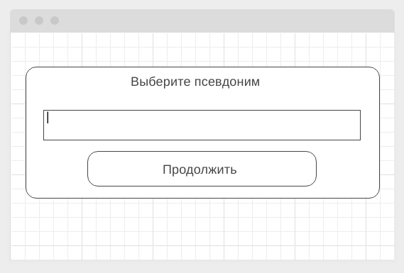

# Домашнее задание к занятию "8. EventSource, Websockets" (frontend)

Правила сдачи задания:

1. В рамках этого ДЗ можно использовать любой менеджер пакетов.
2. Frontend должен собираться через Webpack (включая картинки и стили) и выкладываться на Github Pages через Appveyor.
3. В README.md должен быть размещён бейджик сборки.
4. Серверная часть должна быть выложена на [Render](https://render.com/).
   Посмотрите [инструкцию](https://github.com/netology-code/ahj-homeworks/tree/video/docs/render#readme)
   или [документацию](https://render.com/docs/deploy-node-express-app), как развертывать серверную часть на Render.

---

## Чат

### Легенда

В рамках реализации корпоративного портала вам поручили организовать чат, и вы решили для этого использовать веб-сокеты.

### Описание

Ребята из команды backend уже написали сервер, вам необходимо реализовать клиентскую часть.
Изучите backend, чтобы понять, как нужно взаимодействовать.

При загрузке страницы появляется всплывающее окно, в котором запрашивается никнейм, под которым вы будете зарегистрированы в чате:

Если такой никнейм свободен, то открывается окно чата, в противном же случае вы должны сообщить пользователю о том, что никнейм занят и ему необходимо выбрать другой (продумайте, как вы реализуете это).

Общее окно чата:

Обратите внимание: сообщения всех участников чата (кроме ваших) выравниваются по левому краю, а ваши - по правому.

Важно: `You` - это не никнейм, это указатель на то, что это Вы.

Важная детально: при отключении пользователя он должен удаляться из списка пользователей в левой части.
